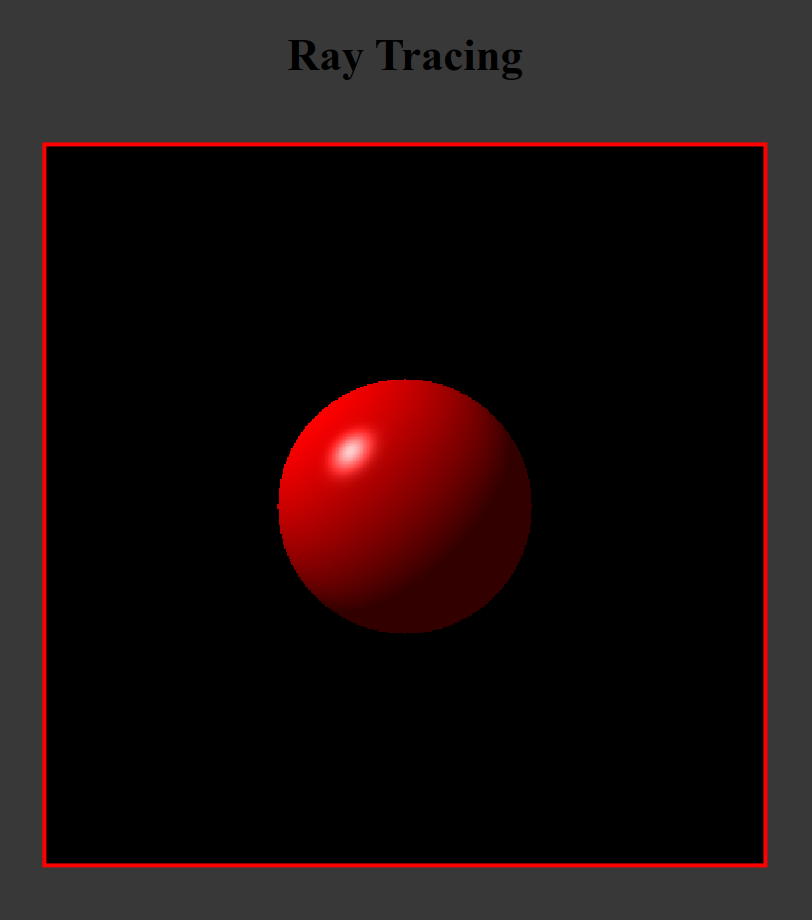
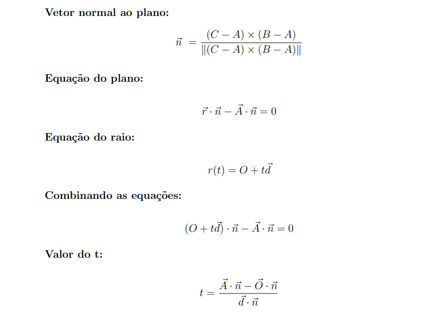
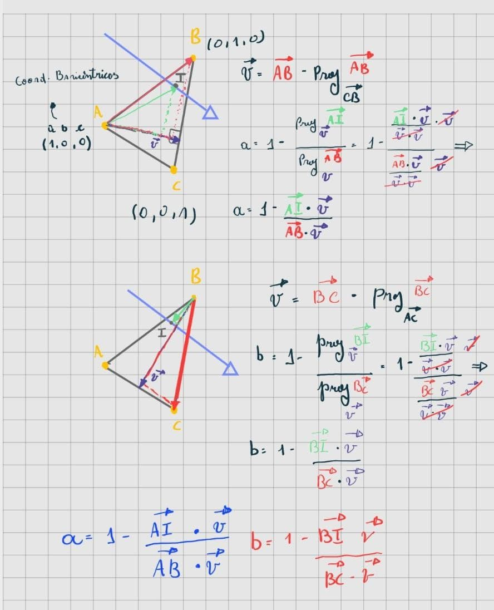
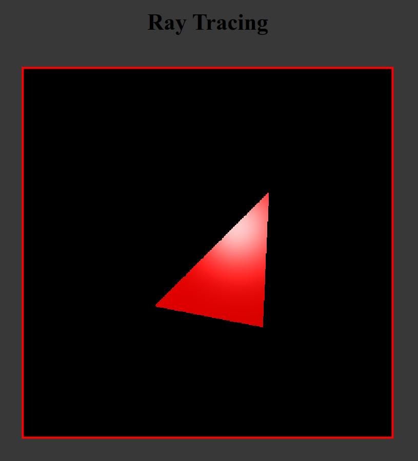
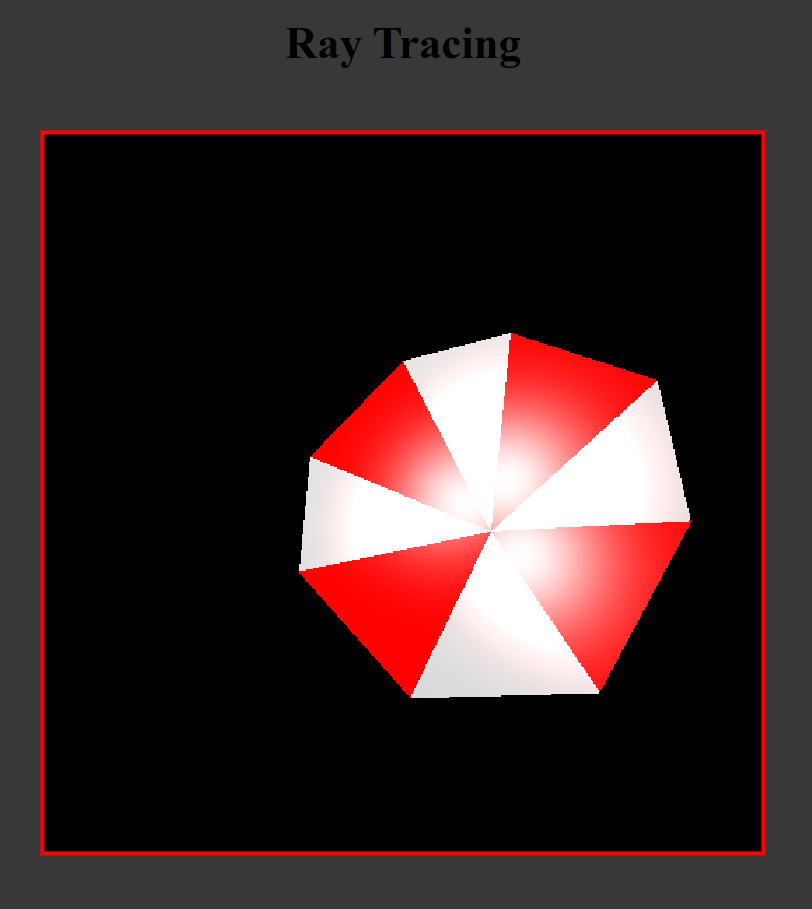
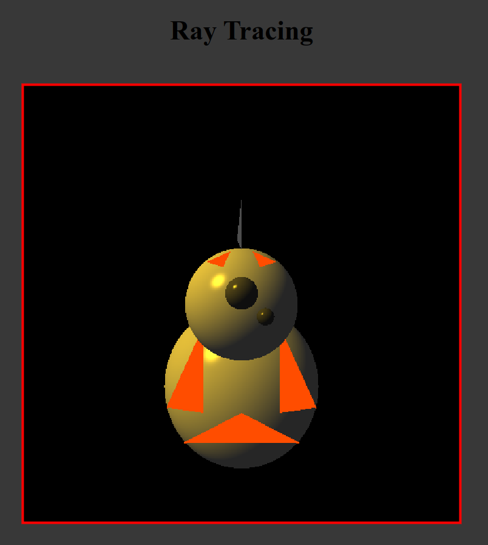
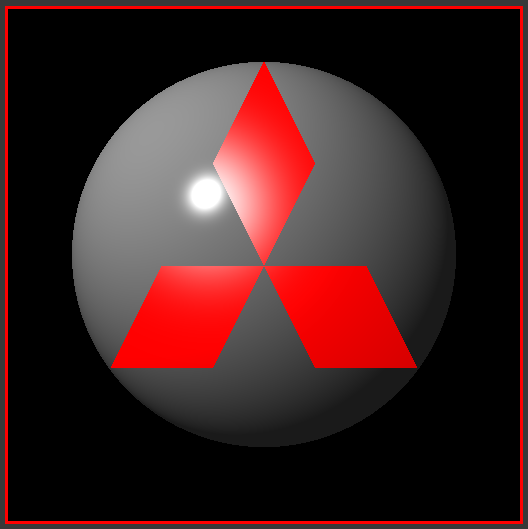

<h1 align = "center"> Atividade Prática 5 - Ray Tracing </h1>

<h3 align="center"> João Victor Rodrigues Galvão - 20190172620</h3>
<h3 align="center"> Yvson Nunes Figueiredo - 20190019716</h3>

## Introdução

O Trabalho desenvolvido aqui teve como objetivo o estudo e implementação de técnicas de Ray Tracing no Rendering de formas geométricas como a esfera e o trấngulo bem como extender o template fornecido pelo 
professor adicionando o modelo completo de iluminação de Phong ao projeto.

## Exercício 1: Inclusão do termo especular no modelo de iluminação local do ray tracer.

O exercício demandou a implementação do termo especular no cálculo da Internsidade luminosa. Em primeiro plano foi necessário estabelecer o vetor **V** que representaria a visão do observador sobre o brilho da superfície, assim,  para determinar o vetor, foi necessário fazer o valor da intersecção do raio com o objeto menos a origem do raio. Por conseguinte, o vetor **R** foi obtido refletindo o vetor **L** (obitido previamente no termo difuso pela posição da luz menos a intersecção com o objeto) em relação a normal sobre o ponto de intersecção. Por fim, levando em consideração o **Ks**, a cor da luz, o expoente de phong (fornecido no trabalho como **n = 32**) o vetor **R** e  **V**, o termo especular foi calculado. 
 
Desse modo, o cálculo se seguiu:

~~~Javascript
 let tE = (Ip.clone().multiply(ks)).multiplyScalar(Math.pow(Math.max(0.0,r.dot(v)),n));
~~~

Finalmente, bastou então se calcular o  valor de **I** 

~~~Javascript
 let I = termoAmbiente.add(termoDifuso).add(termoEspecular);
~~~

### Imagem da esfera calculada a partir da inclusão do termo especular

 

<b>Figura 01: Esfera Phong</b>

### Exercício 2: Inclusão do suporte ao rendering de triângulos.

#### Abordagem Ingênua

Para a implementação do rendering de triângulos inicialmente foi utilizada a abordagem ingênua. A ideia se dividiu em duas etapas.

##### Etapa 1: Colização do raio com o plano que contém o  triângulo.

Matematicamente, utilizando 3 pontos podemos construir um plano. Ademais, é possível modelar o comportamento de um raio pela equação da reta **__r(t) = O + t.d__** em que **t** é um escalar que multiplica o vetor **d** de direção e **O** é a origem do raio. De posse de tais premissas, contruímos a seguinte dedução que fornece o valor de **t** :

 

<b>Figura 02: Dedução do valor de t</b>

Caso de o produto interno de **d** por **n** ser 0, implica-se que o plano que contém o triângulo é paralelo ao raio.

##### Etapa 2: Verificar se intersecção com o triângulo.

Para identificar se intersecção está contida no triângulo foi utilizada coordenadas baricêntricas.
Em primeiro plano, foi necessário dado a intersecção com o triângulo identificar pelo menos suas duas coordenadas baricêntricas em relação ao triângulo.
Isso foi feito utilizando as fórmulas deduzidas abaixo para **a** e **b** (coordenadas) considerando o triângulo ABC e a intersecção **I** do raio.

 

<b>Figura 03: Dedução das coordenadas baricêntricas a e b</b>

De posse das coordenadas, utilizamos as restrições de **a** e **b** serem **números positivos** e **sua soma ser menor ou igual 1** para identificar se o raio intercepta o triângulo.

Além desta implementação, também implementamos o algoritmo de Moller-Trumbore.
### Imagem do triângulo gerado por meio do algoritmo descrito

 

<b>Figura 4: Triângulo segundo abordagem ingênua</b>

### Construção e renderização de uma ou mais cenas.

A seguir segue o simbolo do jogo Resident Evil. A imagem foi feita levando em consideração os seguintes dados que manipulam a iluminação:

~~~Javascript
// Luz

cor_da_luz = (1.0,1.0,1.0)// branco
posicao_da_luz = (-6.0,5.0,4.0)

// Triângulo vermelho ou branco de acordo com a 
//posição na cena
ka = (1.0,0.0,0.0) ou (1.0,1.0,1.0)
kd = (1.0,0.0,0.0) ou (1.0,1.0,1.0)

ks = (1.0,1.0,1.0);
Ia = (0.2,0.2,0.2);

n_phong = 28;

~~~

 

<b>Figura 5: Símbolo Umbrella Coporation</b>

A seguir segue o robô do Star Wars  BB-8 "simplificado". A imagem foi feita levando em consideração os seguintes dados que manipulam a iluminação:

~~~Javascript
// Luz

cor_da_luz = (1,0.8,0.1)// amarelado
posicao_da_luz = (-10.0,10.0,4.0)

// Configurações caso seja uma esfera

// Esfera cinza claro, cinza escuro ou cinza mais escuro de acordo com a 
//posição na cena
ka = (0.75,0.75,0.75) ou (0.3,0.3,0.3) ou (0.25,0.25,0.25)
kd = (0.75,0.75,0.75) ou (0.3,0.3,0.3) ou (0.25,0.25,0.25)

// Configurações caso seja um Triângulo

ka = (1.0,0.3,0.0) ou (0.3,0.3,0.3)

// Triângulo laranja ou cinza escuro de acordo com a 
//posição na cena

// Outras configurações

ks = (1.0,1.0,1.0);
Ia = (0.2,0.2,0.2);
n_phong = 64;

~~~

É valido salientar que os triângulos foram modelados levando em consideração apenas o termo ambiente.

 

<b>Figura 6: BB-8 "simplificado"</b>

Por ultimo, segue o logotipo da mitsubishi. A imagem foi feita levando em consideração os seguintes dados que manipulam a iluminação:

~~~Javascript
// Luz

cor_da_luz = (1.0,1.0,1.0)
posicao_da_luz = (-2.50,2.75,1.0)

// Configurações caso seja uma esfera

ka = kd = (0.5,0.5,0.5)

// Configurações caso seja um Triângulo

ka = kd = (1.0,0.0,0.0)

// Outras configurações

ks = (1.0,1.0,1.0);
Ia = (0.2,0.2,0.2);
n_phong_triangulo = 10;
n_phong_esfera = 64;

~~~

 

<b>Figura 7: Mitsubishi</b>

## Referências

https://www.youtube.com/watch?v=w7bje9GvWEE&t=542s (**Ray plane intersection**)
https://www.youtube.com/watch?v=EZXz-uPyCyA (**Math for Game Developers - Ray Triangle Intersection**)
